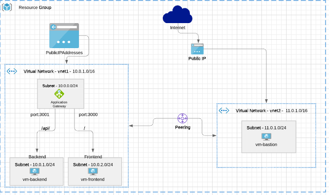

# Terraform para creacion de Arquitectura sobre Azure

[Link Lucidchart](https://lucid.app/lucidchart/2d8ca15b-5562-4239-a0af-65745ed290ac/edit?page=mXwzAnnOLpm1#)

## Terraform init/plan/apply/destroy
Los comandos de terraform se utilizan a traves de [Makefile](Makefile) , siendo los siguientes:

    - make init
    - make plan
    - make apply
    - make destroy 

`La version de terraform` a utilizar se setea en el makefile init utilizando `tfenv`

## SSH Keys(TO DO)
La ssh key hay que autogenerarla(ssh-keygen) y tirarla como output del terraform y en un archivo
ssh -i "/tmp/id_rsa" adminuser@104.208.216.42
ssh -i "/tmp/id_rsa" adminuser@20.65.89.194

## Terraform State
El estado de Terraform se almacena en un `storage Account` de Azure:
